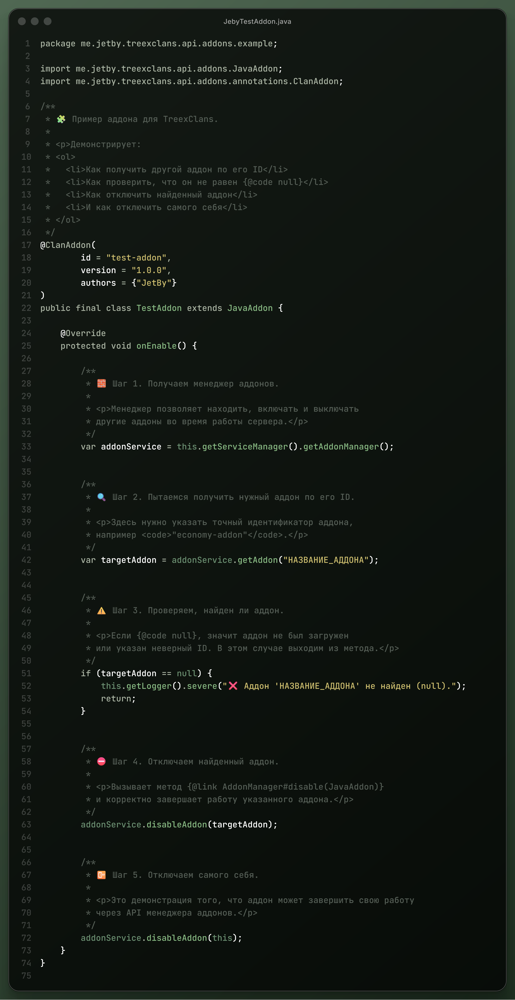

# Project Examples

## 🧩 Addon Development for TreexClans



How to Disable a Plugin

> Using the method <mark style="color:yellow;">this.getServiceManager().getAddonManager().disable(this);</mark>,\
> you can disable either your own addon or any other addon passed as a parameter.\
> The class must extend **`JavaAddon`** for this to work.

<figure><figcaption></figcaption></figure>



###




