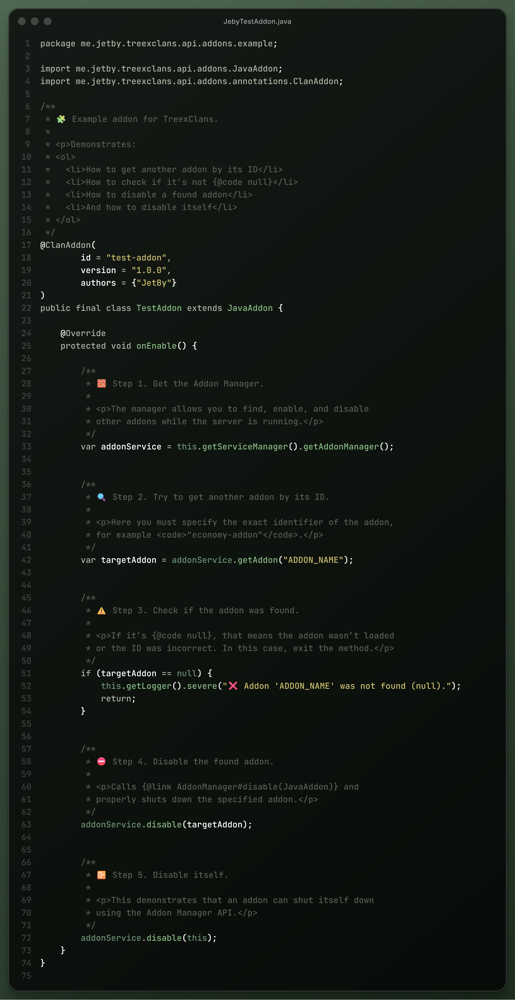

# Project Examples

## 🧩 Addon Development for TreexClans



#### How to Disable a Plugin


Using the method <mark style="color:$danger;">**`this.getServiceManager().getAddonManager().disable(this);`**</mark>,\
you can disable either your own addon or any other addon passed as a parameter.\
The class must extend **`JavaAddon`** for this to work.


<figure><figcaption></figcaption></figure>

\




#### 🎯 Listening to TreexClans Events

<table data-card-size="large" data-view="cards"><thead><tr><th>🧩 Event Name</th><th>📝 Description</th><th>⚙️ Triggered When</th><th>🚫 Cancellable</th><th data-hidden data-card-cover data-type="image">Cover image</th></tr></thead><tbody><tr><td><mark style="color:$primary;">ClanCreateEvent</mark></td><td>
<mark style="color:$primary;">Fired when a new clan is being created through the TreexClans system.</mark>

<mark style="color:$primary;">Addons can validate, modify, or cancel the creation process before the clan is registered.</mark>
</td><td><mark style="color:$primary;">When a player or script attempts to create a new clan.</mark></td><td><mark style="color:$primary;">✅ Yes</mark></td><td data-object-fit="fill"><a href="../../../.gitbook/assets/ba5607fe-24a7-4cd6-a8b7-8fc15cd149bb.png">ba5607fe-24a7-4cd6-a8b7-8fc15cd149bb.png</a></td></tr><tr><td><mark style="color:$primary;">ClanDeleteEvent</mark></td><td>
<mark style="color:$primary;">Fired when a clan is about to be deleted or disbanded.</mark>

<mark style="color:$primary;">Addons can perform cleanup tasks, prevent deletion, or restore a previously cancelled deletion.</mark>
</td><td><mark style="color:$primary;">When a clan is scheduled for removal (manually or automatically).</mark></td><td><mark style="color:$primary;">✅ Yes</mark></td><td data-object-fit="fill"><a href="../../../.gitbook/assets/2e9f83c8-51df-4986-bad8-5ee3be63b2dc.png">2e9f83c8-51df-4986-bad8-5ee3be63b2dc.png</a></td></tr></tbody></table>

***

<figure><figcaption></figcaption></figure>




